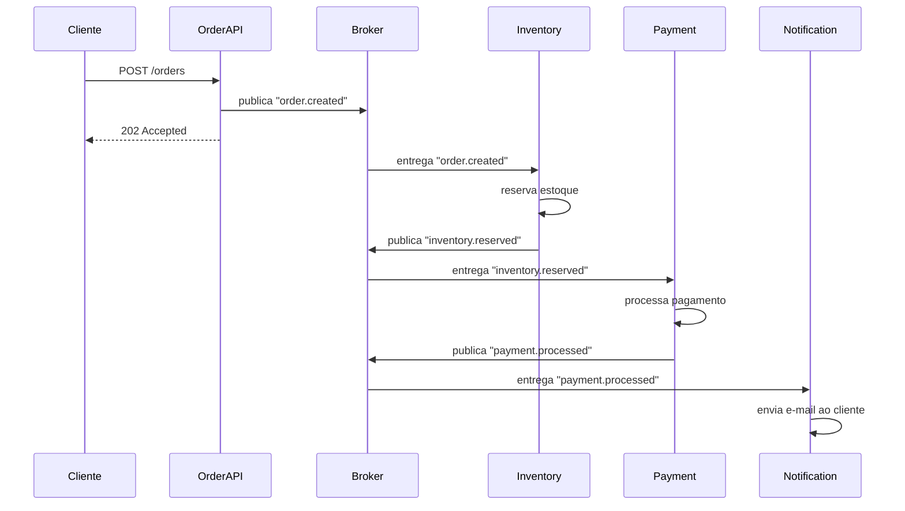
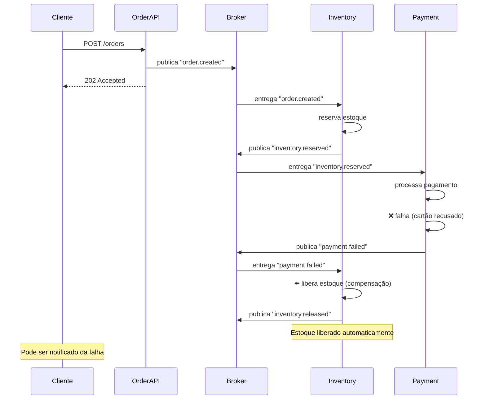
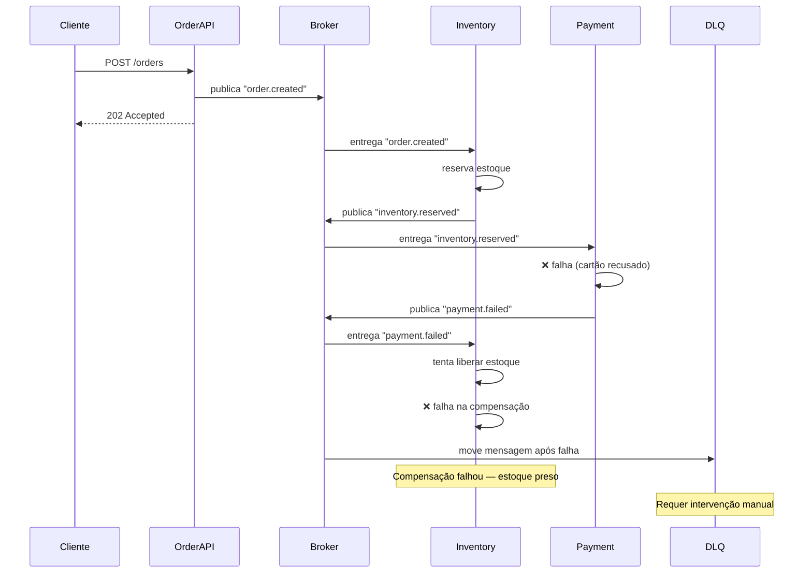

# Choreography Saga

> 📐 Veja a [arquitetura técnica do sistema](./architecture.md) utilizado para demonstrar este padrão.

Choreography Saga é um padrão de coordenação distribuída onde cada serviço sabe o que fazer quando recebe um evento — incluindo como compensar quando algo dá errado.

Cada serviço escuta eventos de sucesso e de falha. Quando um passo falha, o próprio serviço anterior escuta o evento de falha e executa a compensação (rollback). Não existe um coordenador central — a "coreografia" emerge da comunicação entre os serviços.

## Princípios

- Cada serviço conhece seus eventos de entrada e saída (sucesso e falha)
- Compensação distribuída: cada serviço é responsável pelo seu próprio rollback
- Sem coordenador central — os serviços reagem a eventos de sucesso e de falha
- Consistência eventual com mecanismo de compensação automático
- O fluxo é implícito (não existe uma definição centralizada dos passos)

## O que ele resolve bem

- Fluxos de múltiplos passos com necessidade de rollback
- Cenários onde cada serviço pode compensar independentemente
- Sistemas onde adicionar/remover um passo não deve impactar um orquestrador central

## O que ele não resolve

- Fluxos complexos com muitos passos (a coreografia fica difícil de rastrear)
- Cenários onde a ordem dos passos muda frequentemente
- Visibilidade centralizada do estado da saga (cada serviço sabe só a sua parte)
- Ciclos ou dependências circulares entre eventos

## Cenários de Uso

### Cenário Feliz

### Cenário de Erro com Compensação

Pagamento falha, mas agora o sistema reage: o Payment publica um evento de falha e o Inventory escuta para desfazer a reserva.

### Cenário de Falha na Compensação

Se a compensação também falhar (Inventory não consegue liberar o estoque), a mensagem vai para a DLQ. O sistema fica inconsistente e precisa de intervenção manual — similar ao fire-and-forget, mas com a diferença de que a tentativa de compensação foi feita.

