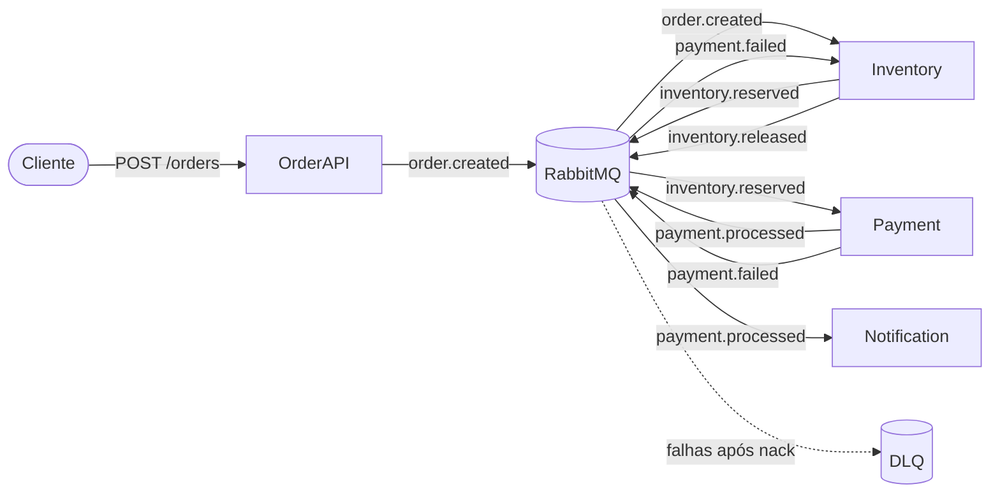

# Arquitetura — Choreography Saga

## Visão Geral

O sistema simula um fluxo de pedido de compra com compensação automática. Quando um passo falha, o serviço anterior escuta o evento de falha e desfaz sua operação. Não existe orquestrador — cada serviço sabe reagir a sucessos e falhas.



## Serviços

| Serviço | Responsabilidade | Publica | Consome |
|---------|-----------------|---------|---------|
| **Order API** | Recebe pedido via HTTP e publica evento | `order.created` | — |
| **Inventory** | Reserva/libera estoque | `inventory.reserved`, `inventory.released` | `order.created`, `payment.failed` |
| **Payment** | Processa pagamento | `payment.processed`, `payment.failed` | `inventory.reserved` |
| **Notification** | Notifica o cliente | — | `payment.processed` |

## Fluxo de Eventos

### Exchanges e Filas

| Exchange | Tipo | Routing Key | Fila destino |
|----------|------|-------------|--------------|
| `order.exchange` | topic | `order.created` | `choreography-saga.order.created.queue` |
| `choreography-saga.inventory.exchange` | topic | `inventory.reserved` | `choreography-saga.inventory.reserved.queue` |
| `choreography-saga.inventory.exchange` | topic | `inventory.released` | (observabilidade) |
| `choreography-saga.payment.exchange` | topic | `payment.processed` | `choreography-saga.payment.processed.queue` |
| `choreography-saga.payment.exchange` | topic | `payment.failed` | `choreography-saga.payment.failed.queue` |

### Compensação

- **Payment falha** → publica `payment.failed`
- **Inventory escuta `payment.failed`** → libera estoque (compensação) → publica `inventory.released`

### Dead Letter Queue

Mesma mecânica do fire-and-forget: mensagens que falham no handler vão para `<queue>.dlq` via `<queue>.dlx`.

## Estrutura do Projeto

```
apps/
  base/
    order-api/             ← API HTTP (compartilhada)
  choreography-saga/
    inventory-worker/      ← Consumer RabbitMQ (reserva + compensação)
    payment-worker/        ← Consumer RabbitMQ (pagamento + evento de falha)
    notification-worker/   ← Consumer RabbitMQ

docs/
  choreography-saga/
    README.md              ← Documento conceitual
    architecture.md        ← Este documento

docker-compose.choreography-saga.yaml
```
