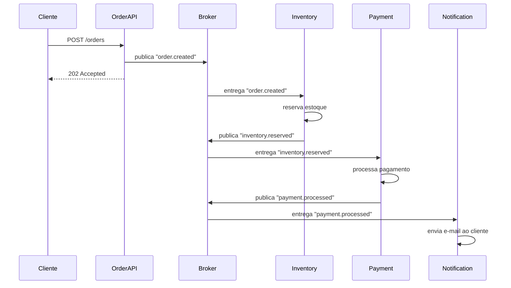
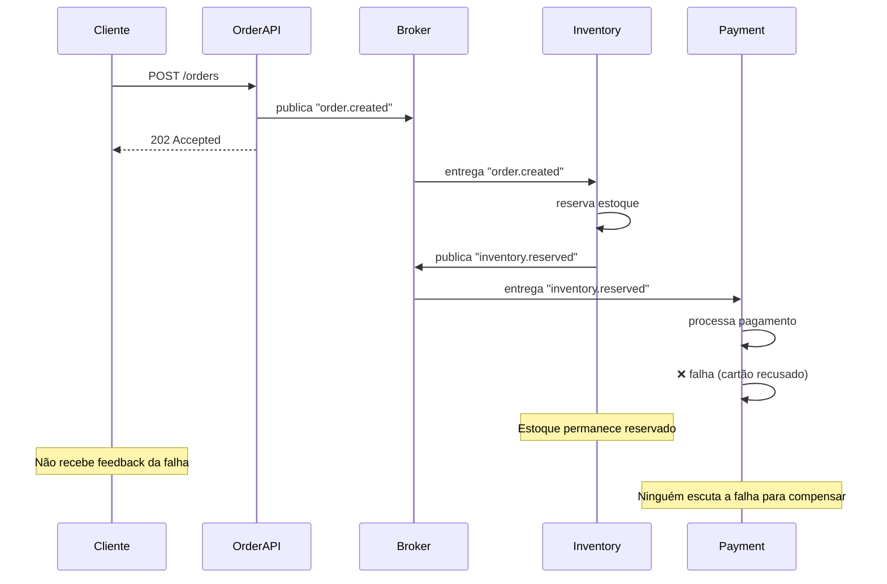
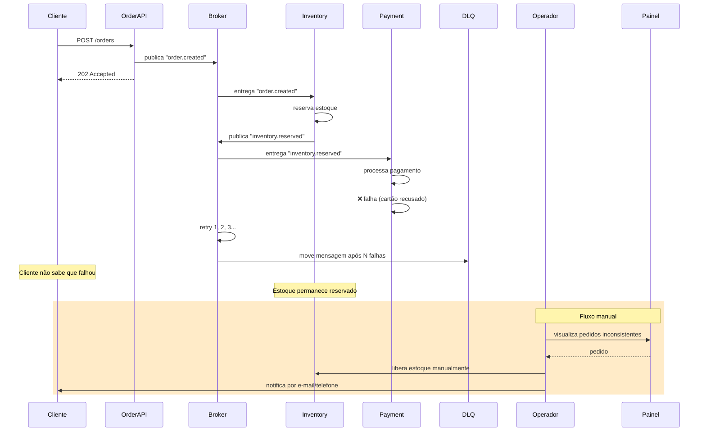

# EDA Fire-and-Forget

> 📐 Veja a [arquitetura técnica do sistema](./architecture.md) utilizado para demonstrar este padrão.

EDA Fire-and-Forget é o padrão mais simples de arquitetura orientada a eventos.

O produtor publica um evento no broker e segue em frente. Ele não sabe quem vai consumir, não espera confirmação de que o processamento deu certo, e não tem responsabilidade sobre o que acontece depois.

Do lado do consumidor, ele escuta o evento, processa, e pronto. Se der certo, ótimo. Se falhar, o problema é dele — o produtor não fica sabendo.

## Princípios

- Desacoplamento total entre produtor e consumidor
- Comunicação unidirecional (produtor → broker → consumidor)
- Sem correlação entre request e response
- Sem garantia de consistência transacional entre serviços
- O produtor assume que "publicar = missão cumprida"

## O que ele resolve bem

- Notificações (enviar e-mail, push, SMS)
- Logging e auditoria
- Atualização de cache
- Qualquer operação onde falha no consumidor não compromete o estado do sistema

## O que ele não resolve

- Fluxos que precisam de múltiplos passos coordenados
- Operações que precisam de rollback se um passo falhar
- Cenários onde o produtor precisa saber se o consumidor processou com sucesso

## Cenários de Uso

### Cenário Feliz

### Cenário de Erro

Pagamento falha e o sistema fica em estado inconsistente — estoque reservado sem pedido concluído.

### Cenário de Contingência

Sem compensação automática, nenhum serviço reage à falha. A mensagem que falhou vai para uma Dead Letter Queue (DLQ) após N tentativas de retry do broker. Um operador humano identifica o problema através de um painel administrativo e resolve manualmente: libera o estoque reservado, cancela o pedido e notifica o cliente por fora do sistema.

