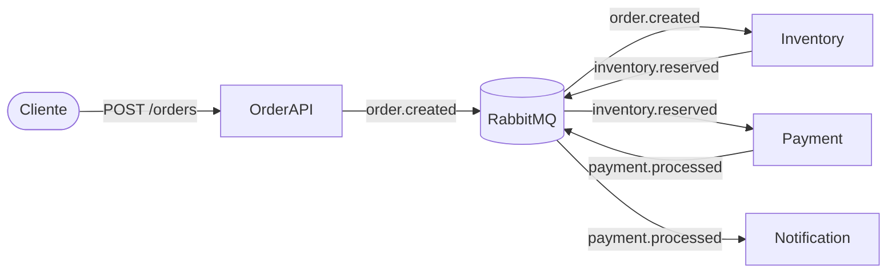

# Arquitetura — Fire-and-Forget

## Visão Geral

O sistema simula um fluxo de pedido de compra onde cada etapa é um serviço independente que se comunica exclusivamente por eventos via RabbitMQ. Nenhum serviço chama outro diretamente — toda comunicação é assíncrona e unidirecional.



## Serviços

| Serviço | Responsabilidade | Publica | Consome |
|---------|-----------------|---------|---------|
| **Order API** | Recebe pedido via HTTP e publica evento | `order.created` | — |
| **Inventory** | Reserva estoque do produto | `inventory.reserved` | `order.created` |
| **Payment** | Processa pagamento do pedido | `payment.processed` | `inventory.reserved` |
| **Notification** | Envia notificação ao cliente (e-mail/push) | — | `payment.processed` |

## Fluxo de Eventos

### Exchanges e Filas

| Exchange | Tipo | Routing Key | Fila destino |
|----------|------|-------------|--------------|
| `order.exchange` | topic | `order.created` | `fire-and-forget.order.created.queue` |
| `fire-and-forget.inventory.exchange` | topic | `inventory.reserved` | `fire-and-forget.inventory.reserved.queue` |
| `fire-and-forget.payment.exchange` | topic | `payment.processed` | `fire-and-forget.payment.processed.queue` |


## Observabilidade

- **RabbitMQ Management** (http://localhost:15672) — estado das filas, consumers conectados
- **Grafana + Tempo** (http://localhost:3000) — tracing distribuído mostrando o fluxo do pedido entre serviços

## Estrutura do Projeto

```
apps/
  base/
    order-api/             ← API HTTP (compartilhada entre padrões)
  fire-and-forget/
    inventory-worker/      ← Consumer RabbitMQ
    payment-worker/        ← Consumer RabbitMQ
    notification-worker/   ← Consumer RabbitMQ

docs/
  fire-and-forget/
    README.md              ← Documento conceitual (EDA Fire-and-Forget)
    architecture.md        ← Este documento

docker-compose.fire-and-forget.yaml
```
