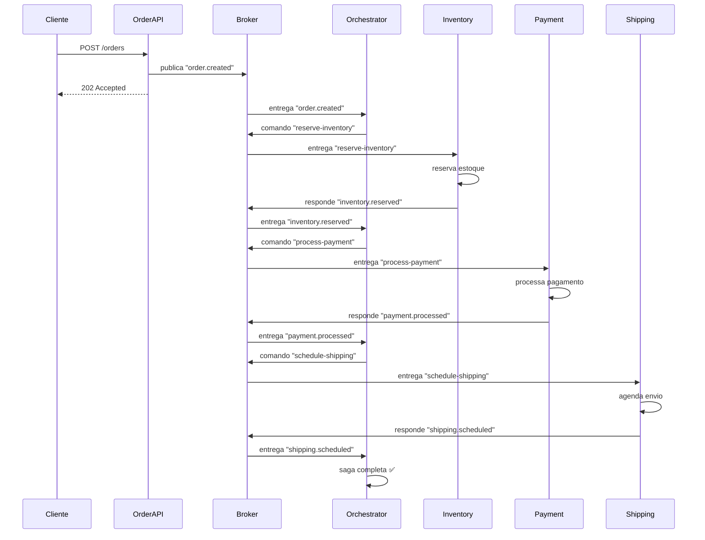
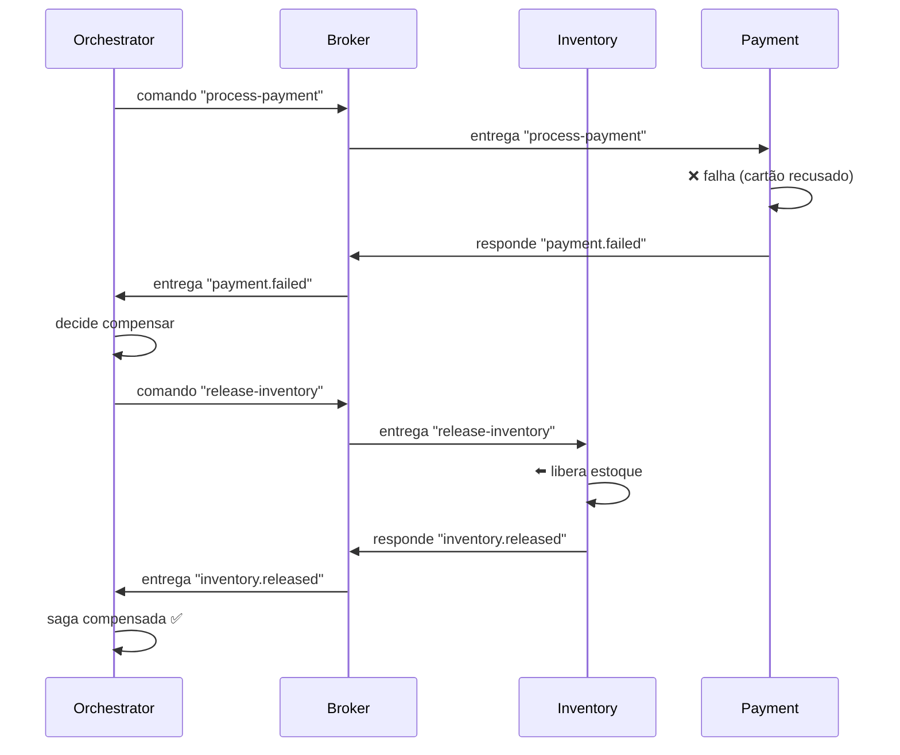
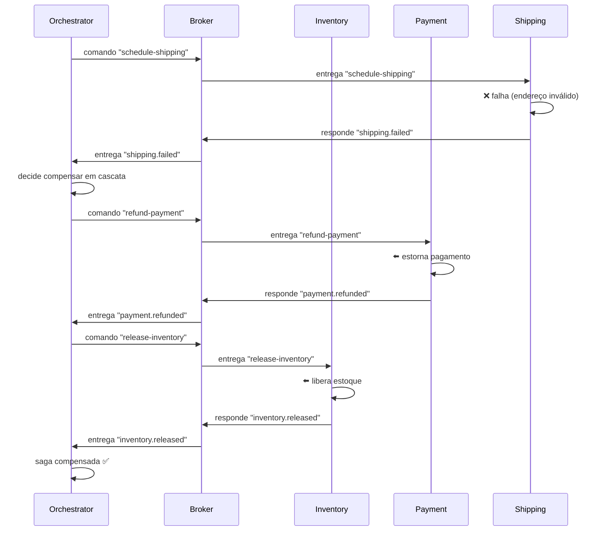
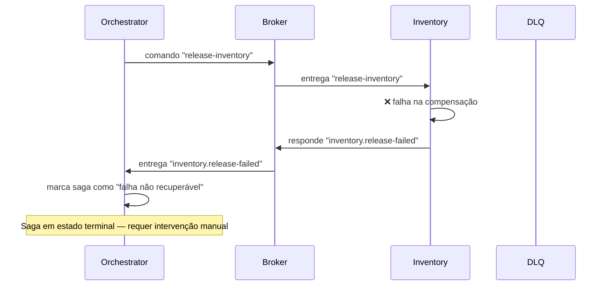

# Orchestration Saga

> 📐 Veja a [arquitetura técnica do sistema](./architecture.md) utilizado para demonstrar este padrão.

Orchestration Saga é um padrão de coordenação distribuída onde um serviço central (o orquestrador) controla o fluxo da saga. Ele sabe quais passos executar, em qual ordem, e o que compensar quando algo falha.

Os workers são "burros" — recebem um comando, executam, e respondem com sucesso ou falha. Toda a lógica de decisão (próximo passo, compensação, retry) está centralizada no orquestrador.

## Princípios

- Um coordenador central define e controla o fluxo da saga
- Workers não sabem da existência uns dos outros
- Compensação centralizada: o orquestrador decide o que desfazer e em qual ordem
- O estado da saga é mantido pelo orquestrador (visibilidade total do progresso)
- Fluxo explícito — fácil de entender, debugar e alterar

## O que ele resolve bem

- Fluxos complexos com muitos passos e dependências
- Cenários onde a ordem pode mudar sem impactar os workers
- Visibilidade centralizada do estado de cada saga
- Lógica de compensação complexa (pular passos, compensação parcial)
- Fluxos com branching condicional (se X, faz Y; senão, faz Z)

## O que ele não resolve

- O orquestrador é um ponto único de falha (precisa de alta disponibilidade)
- Pode se tornar um gargalo se concentrar muita lógica
- Maior acoplamento ao orquestrador (se ele muda, impacta o fluxo inteiro)
- Mais complexo de implementar que fire-and-forget ou choreography

## Cenários de Uso

### Cenário Feliz

### Cenário de Erro — Payment falha

O orquestrador recebe a falha e decide compensar na ordem inversa.

### Cenário de Erro — Shipping falha (compensação em cascata)

O orquestrador desfaz todos os passos anteriores na ordem inversa.

### Cenário de Falha na Compensação

Se um passo de compensação falhar, o orquestrador pode aplicar retries ou mover a saga para um estado de "falha não recuperável" que requer intervenção manual.

