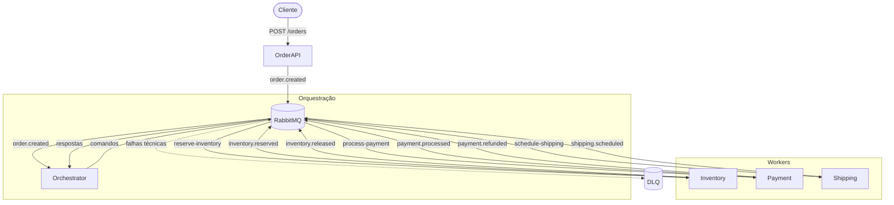

# Arquitetura — Orchestration Saga

## Visão Geral

O sistema simula um fluxo de pedido de compra com um orquestrador central que controla a execução e compensação da saga. Os workers são simples — recebem comandos e respondem. O orquestrador mantém o estado e decide o próximo passo.



## Serviços

| Serviço | Responsabilidade | Publica | Consome |
|---------|-----------------|---------|---------|
| **Order API** | Recebe pedido via HTTP e publica evento | `order.created` | — |
| **Orchestrator** | Controla o fluxo da saga, decide passos e compensações | comandos (`reserve-inventory`, `process-payment`, `schedule-shipping`, `release-inventory`, `refund-payment`) | respostas dos workers |
| **Inventory** | Reserva/libera estoque sob comando | `inventory.reserved`, `inventory.released` | `reserve-inventory`, `release-inventory` |
| **Payment** | Processa/estorna pagamento sob comando | `payment.processed`, `payment.failed`, `payment.refunded` | `process-payment`, `refund-payment` |
| **Shipping** | Agenda envio sob comando | `shipping.scheduled`, `shipping.failed` | `schedule-shipping` |

## Fluxo de Eventos

### Exchanges e Filas

| Exchange | Tipo | Routing Key | Fila destino |
|----------|------|-------------|--------------|
| `order.exchange` | topic | `order.created` | `orchestration-saga.order.created.queue` |
| `orchestration-saga.commands.exchange` | topic | `reserve-inventory` | `orchestration-saga.reserve-inventory.queue` |
| `orchestration-saga.commands.exchange` | topic | `process-payment` | `orchestration-saga.process-payment.queue` |
| `orchestration-saga.commands.exchange` | topic | `schedule-shipping` | `orchestration-saga.schedule-shipping.queue` |
| `orchestration-saga.commands.exchange` | topic | `release-inventory` | `orchestration-saga.release-inventory.queue` |
| `orchestration-saga.commands.exchange` | topic | `refund-payment` | `orchestration-saga.refund-payment.queue` |
| `orchestration-saga.replies.exchange` | topic | `inventory.reserved` | `orchestration-saga.replies.queue` |
| `orchestration-saga.replies.exchange` | topic | `payment.processed` | `orchestration-saga.replies.queue` |
| `orchestration-saga.replies.exchange` | topic | `payment.failed` | `orchestration-saga.replies.queue` |
| `orchestration-saga.replies.exchange` | topic | `shipping.scheduled` | `orchestration-saga.replies.queue` |
| `orchestration-saga.replies.exchange` | topic | `shipping.failed` | `orchestration-saga.replies.queue` |

### Máquina de Estados da Saga

```
CREATED → RESERVING_INVENTORY → PROCESSING_PAYMENT → SCHEDULING_SHIPPING → COMPLETED
                ↓                       ↓                      ↓
          RELEASING_INVENTORY ← REFUNDING_PAYMENT ←    COMPENSATING
                ↓                       ↓
             FAILED                  FAILED
```

### Dead Letter Queue

Mensagens que falham tecnicamente (erro de parse, timeout, etc.) vão para `<queue>.dlq`. Falhas de negócio (cartão recusado, endereço inválido) são tratadas pelo orquestrador como respostas normais.

## Estrutura do Projeto

```
apps/
  base/
    order-api/             ← API HTTP (compartilhada)
  orchestration-saga/
    orchestrator/          ← Coordenador central da saga
    inventory-worker/      ← Worker simples (reserva/libera sob comando)
    payment-worker/        ← Worker simples (cobra/estorna sob comando)
    shipping-worker/       ← Worker simples (agenda sob comando)

docs/
  orchestration-saga/
    README.md              ← Documento conceitual
    architecture.md        ← Este documento

docker-compose.orchestration-saga.yaml
```
